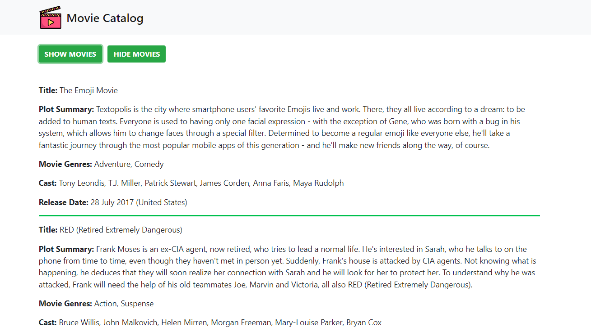

# Movie Catalog Refactoring

This project is refactoring of the [Movie Catalog project](https://github.com/elisa-amaral/Movie-Catalog). The purpose of this project was to implement asynchronous requests with JavaScript and XMLHTTPRequest (AJAX) using JSON as the movie list file format, which was coded in XML and needed a JS script to convert XML to JSON in the [previous version](https://github.com/elisa-amaral/Movie-Catalog).

## Screenshot

## Technology Stack

+ JavaScript
+ AJAX
+ JSON
+ HTML
+ CSS
+ Bootstrap

